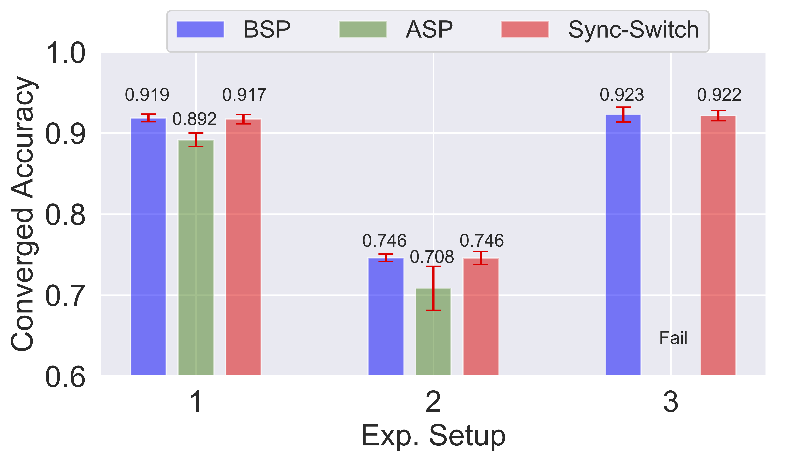
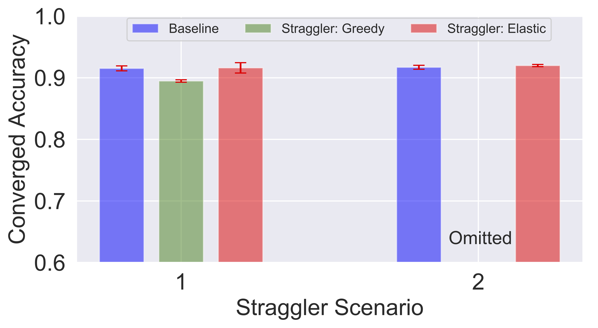
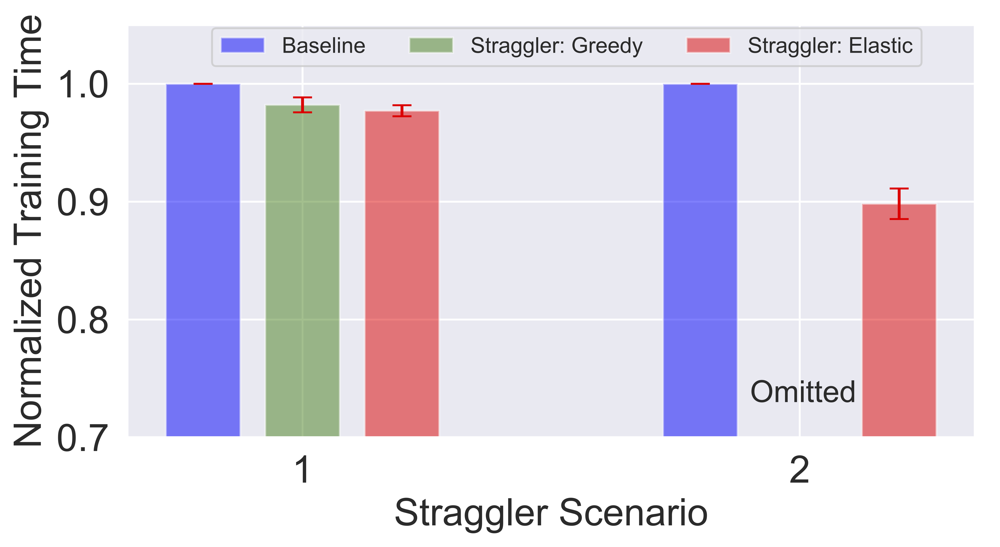

# Sync-Switch: Hybrid Parameter Synchronization for Distributed Deep Learning

## About

This is the official repo for the paper [**Sync-Switch: Hybrid Parameter Synchronization for Distributed Deep Learning**](https://arxiv.org/abs/2104.08364) (to appear) in the proceedings of ICDCS'21. 

The paper presented a hybrid synchronization approach that exploits the benefits of both BSP and ASP, i.e., reducing training time while simultaneously maintaining the converged accuracy. Based on extensive empirical profiling, we devise a collection of adaptive policies that determine how and when to switch between synchronization protocols. Our policies include both offline ones that target recurring jobs and online ones for handling transient stragglers. We implement the proposed policies in a prototype system, called Sync-Switch, on top of TensorFlow, and evaluate the training performance with popular deep learning models and datasets. 

#### Paper 

[Sync-Switch: Hybrid Parameter Synchronization for Distributed Deep Learning](https://arxiv.org/abs/2104.08364).  

If you use the Sync-Switch data or code, please either cite the arxiv version or our ICDCS version:

Bibtex for the ICDCS version: 
```bibtex
@INPROCEEDINGS{li2021syncswitch_icdcs,  
author={Li, Shijian and Mangoubi, Oren and Xu, Lijie and Guo, Tian},  
booktitle={2021 IEEE 41th International Conference on Distributed Computing Systems (ICDCS)},   
title={Sync-Switch: Hybrid Parameter Synchronization for Distributed Deep Learning},   
year={2021}
}
```

Bibtex for the arXiv version: 
```bibtex
@misc{li2021syncswitch_arxiv,
      title={Sync-Switch: Hybrid Parameter Synchronization for Distributed Deep Learning}, 
      author={Shijian Li and Oren Mangoubi and Lijie Xu and Tian Guo},
      year={2021},
      eprint={2104.08364},
      archivePrefix={arXiv},
      primaryClass={cs.DC}
}
```


#### Highlight

- Sync-Switch achieves up to **5.13X** throughput speedup and similar converged accuracy when comparing to fully sychronous training. 

- Sync-Switch achieves **3.8% higher** converged accuracy with just **1.23X** the training time compared to training with fully asynchronous training. 

- Sync-Switchcan effectively circumvent the performance degradation caused by transient stragglers and instead leads to a 1.1X speedup under moderate slowdown scenarios

<div align="center"></div>

**Fig 1. Converged accuracy comparison with baselines**

<div align="center"></div>

**Fig 2. Total training time comparison with baselines**

<div align="center"></div>

**Fig 3. Converged accuracy comparison of straggler scenarios**

<div align="center"></div>

**Fig 4. Total training time comparison of straggler scenarios**

## Code instruction

#### Dependency and cloud image

The code used custom cloud images for both GPU and CPU servers, and the images are currently not public. Thus in order to run it, you need to create two custom images first.

We ran the code on cloud servers with Ubuntu 18.04 LTS, 4 vCPU cores and 24 GB memory for PS, 8 vCPU cores and 51 GB for workers, with 100 GB HD disk space. Ubuntu 16.04 LTS might work, but wil have unexpected behavior such as shutdown scripts not working properly.

First create a VM and `ssh` into it.

Then update apt-get and install the dependencies. 
```bash
sudo apt-get update
sudo apt-get install -y openjdk-8-jdk git python-dev python3-dev python-numpy python3-numpy build-essential python-pip python3-pip python-virtualenv swig python-wheel libcurl3-dev curl g++ freeglut3-dev libx11-dev libxmu-dev libxi-dev libglu1-mesa libglu1-mesa-dev parallel
```

Install nvidia drivers; the code is based on CUDA 9.0. Notice: all the CUDA and CUDNN related dependencies are not required for the CPU image.
```bash
### Install NVIDIA driver
sudo apt install nvidia-384 nvidia-384-dev
### CUDA 9.0 requires gcc 6.0
sudo apt install gcc-6
sudo apt install g++-6
### Get CUDA 9.0 files and install
wget https://developer.nvidia.com/compute/cuda/9.0/Prod/local_installers/cuda_9.0.176_384.81_linux-run
chmod +x cuda_9.0.176_384.81_linux.run
sudo ./cuda_9.0.176_384.81_linux.run --override
```

After rebooting the VM, check if CUDA is installed properly.
```bash
sudo reboot
nvidia-smi
```

An operational GPU would return something like:
```
+-----------------------------------------------------------------------------+
| NVIDIA-SMI 396.26                 Driver Version: 396.26                    |
|-------------------------------+----------------------+----------------------+
| GPU  Name        Persistence-M| Bus-Id        Disp.A | Volatile Uncorr. ECC |
| Fan  Temp  Perf  Pwr:Usage/Cap|         Memory-Usage | GPU-Util  Compute M. |
|===============================+======================+======================|
|   0  Tesla K80           Off  | 00000000:00:04.0 Off |                    0 |
| N/A   35C    P8    27W / 149W |     15MiB / 11441MiB |      0%      Default |
+-------------------------------+----------------------+----------------------+
                                                                               
+-----------------------------------------------------------------------------+
| Processes:                                                       GPU Memory |
|  GPU       PID   Type   Process name                             Usage      |
|=============================================================================|
|    0      1658      G   /usr/lib/xorg/Xorg                            14MiB |
+-----------------------------------------------------------------------------+
```

Install CUDNN 7.5; you need to go to the Nvidia website and register, then download the `tar` file and install it.


Edit cuda path to `~/.bashrc` and reload it.
```bash
echo 'export PATH=/usr/local/cuda-9.0/bin:$PATH' >> ~/.bashrc
echo 'export LD_LIBRARY_PATH=/usr/local/cuda-9.0/lib64:$LD_LIBRARY_PATH' >> ~/.bashrc
source ~/.bashrc
```

Don't forget to move CUDNN to the CUDA folder.
```
sudo cp -P cuda/include/cudnn.h /usr/local/cuda-9.0/include
sudo cp -P cuda/lib64/libcudnn* /usr/local/cuda-9.0/lib64/
sudo chmod a+r /usr/local/cuda-9.0/lib64/libcudnn*
```

The last step would be to install `TensorFlow 1.10` and modified `Tensor2Tensor`. `Tensor2Tensor` can be found in the `code` folder.
```bash
sudo pip install tensorflow-gpu==1.10
## for cpu servers install tensorflow==1.10 instead
pip install -e ~/code/tensor2tensor
sudo pip install mesh-tensorflow == 0.0.5
sudo pip install upgrade google-api-python-client
```

After the dependency installation, make two images, one for workers and one for parameter servers. Example command as below (to create the `instance-gpu` and `instance-cpu` images that we used in the code):
```bash
gcloud compute instances set-disk-auto-delete instance-gpu \
--disk instance-gpu --no-auto-delete

gcloud compute instances set-disk-auto-delete instance-cpu \
--disk instance-cpu --no-auto-delete

gcloud compute images create gpu-ubuntu18 \
--source-disk instance-gpu

gcloud compute images create cpu-ubuntu18 \
--source-disk instance-cpu
```

#### Running the code

The code supports training models implemented in the Tensor2Tensor library. For the paper we mainly used ResNet models. The code currently supports Google Compute Engine but should be easily extendable to other cloud platforms such as AWS.

To run the code, simply input the following command. It will set up a cluster with 1 parameter server and 4 workers equipped with K80 GPU, and train the CIFAR-10 dataset on ResNet-32 for 64k steps. The trained model will be generated in the specified cloud bucket. 

```bash
python main.py \
    --job-name [A string for the name of the training job] \
    --num-ps [The number of parameter server used] \
    --num-worker [The number of worker used. In this project it is set to be the same as the number of parameter servers because we colocate them on the same instance] \
    --bucket-dir [The destination bucket on the cloud for the training directory] \
    --model [DNN model, see Tensor2Tensor for supported models] \
    --hparam-set [Predefined hyper-parameter set to use] \
    --problem [Training dataset name] \
    --data-dir [Dataset url] \
    --train-steps [Converted training steps for the first synchronization protocol][Converted training steps for second synchronization protocol]... \
    --ckpt-frequency [Checkpoint frequency for the first synchronization protocol][Checkpoint frequency for the second synchronization protocol]... \
    --cluster-name [Name of the cloud-based cluster] \
    --eval-name [Name of the evaluator instance] \
    --switch-order [A string representing the switching order, 1 means BSP and 0 ASP. For example, 101 means we start with BSP, then switch to ASP, then BSP again] \
    --hparams [Manual changes to hyper-parameters for the first synchronization protocol. For example, to change the learning rate decay scheme to cosine, input learning_rate_decay_scheme='cosine'][Manual changes to hyper-parameters for the second synchronization protocol]...
```

## Data description

The experiment data can be found in the data directory. 

- `bsp_job.txt` and `asp_job.txt` contain the records for the monitored BSP and ASP training session, respectively.

- `cifar10_res32/` contains experiments data of training ResNet32 on Cifar-10 with 8 workers

- `cifar100_res50/` contains experiments data of training ResNet50 on Cifar-100 with 8 workers

- `cluster_16/` contains experiments data of training ResNet32 on Cifar-10 with 16 workers

- `straggler/` contains experiments data involving slowdown scenarios

For each child directory under the `data/`, we further breakdown the experiment data based on their respective experiment configurations. Below, we explain the naming schemes used. 

- `/cifar10_res32`
    - `/cifar10_res32/baseline` are ASP and BSP baseline data folders labeled as `asp_[run num] and bsp_[run num]`. 
    - `/cifar10_res32/switch_exp` are hybrid training data labeled as `a/b_[proportion]_[a/b]_[proportion]_[run num]`
    - The `/cifar10_res32/dynamic` folder contains data of several experiments to use plateaued training loss value as the switching point. Wasn't used in the paper
    - The `/cifar10_res32/momentum_tunning` folder contains data of several experiments on tunning the momentum during switching to improve training performance. See `readme` inside for details.
- `/cifar100_res50`
    - ASP and BSP baselines are named asp/bsp_[run num]. Hybrid training data are labeled as `[bsp proportion]_[asp proportion]_[run num]`.
- `/cluster_16`
    - BSP baseline is named bsp_[run num]. No ASP because training failure. Hybrid training data are labeled as `[bsp proportion]_[asp proportion]_[run num]`.
- `/straggler`
    - Baselines are `sync/async/hybrid_baseline_[run num]`
    - Data for the experiments shown in the Evaluation section are labeled as `baseline/policy1/policy2_[frequency of straggler]_[number of straggler]_[run num`

In each child directory `loss.csv` and `acc.csv` contains raw data, and `loss_proc.csv` and `acc_proc.csv` processed data. `Weight_decay.csv` contains additional data on quantified weight decay during the training, but was not used in the paper.

## Acknowledgement

This work is supported in part by National Science Foundation grants #1755659 and #1815619, and Google Cloud Platform Research credits.

## Contact

More project information can be found in our lab's [project site](https://cake-lab.github.io/projects/). Should you have any questions, please contact 
Shijian Li [sli8@wpi.edu](sli8@wpi.edu) and Tian Guo [tian@wpi.edu](tian@wpi.edu).
